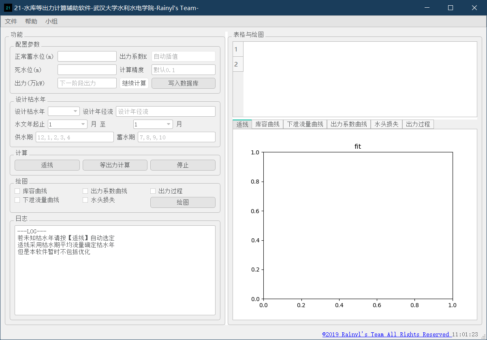
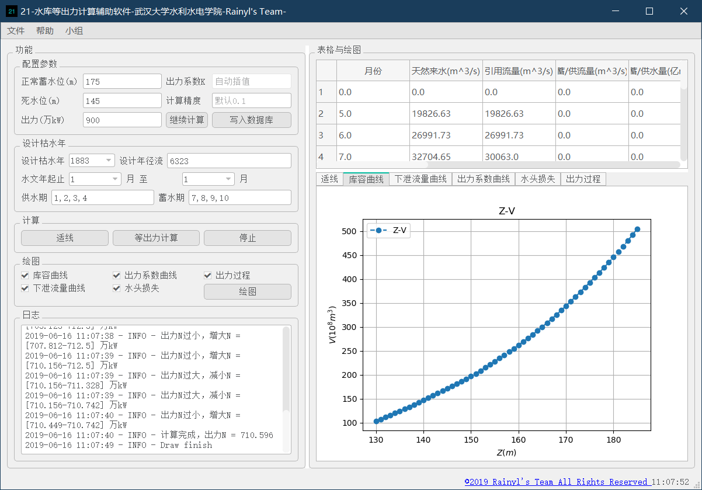

# 水库等出力计算软件
数据库与水利应用开发大作业

[toc]

作者：rainyl

开发语言： python3

## 使用帮助
### 数据准备
软件使用`SQLite3`作为后台数据库，使用前请准备如下数据：
- 水文年月流量数据，`q_mon_sw` `m^3/s`
- 水库库容曲线，`zv`,水位`m`,库容`亿m^3`
- 尾水位-流量曲线, 水位`m`, 尾水流量`m^3/s`
- 水头损失表，`odh`, 机组流量`m^3/s`，水头损失`m`
- 出力系数曲线，`K`,平均水头`m`，出力系数

以上数据请存入`SQLite3`数据库，样例参见本项目下的`sanxia.db`
### 界面介绍
主界面如下

整体分为四部分
- 左上功能区
包括参数的输入，按钮等
- 左下日志区
输出程序运行日志，您总是可以在这里看到程序运行情况与提示
- 右上表格区
主要输出表格
- 右下绘图区
绘制各类图像
### 功能介绍
#### 频率曲线适线
本软件也可以进行简单的水文频率曲线适线工作，要开始适线，
要开始适线，首先打开您刚才创建好的数据库

点击菜单栏文件-打开-数据库，选择数据库并打开。

此时程序读入流量数据，点击功能区`适线`按钮进行适线，结果将在右侧显示。
如下图所示

#### 图像绘制
当打开数据库之后，您可以进行绘图，选择左侧功能区的`绘图`部分中
您想绘制的曲线，再点击`绘图`按钮，即可在右侧绘图区看到相应图像

注意：只有您进行了等出力计算，等出力图像才可以被绘制。
#### 等出力计算

首先填写左侧水位数据，计算精度，（出力系数将进行自动插值），再选择设计枯水年，填写设计年径流、
供水期、蓄水期需要您自行确定并填写

再点击等出力计算，当填写正确，程序将进行计算，所得结果将于左侧日志区显示，
第一次计算默认等出力600万kw，第一次计算完毕您需要根据提示再左上`出力`一栏

填写下一阶段出力，当填写合适，程序将启动子线程采用二分法进行逼近，若计算正确，计算结果将在右侧表格显示，
同时您可以选择绘制出力过程曲线。

注意：

- 计算结果受数据与计算精度影响，当计算精度过高有可能无法收敛到精度以内，造成死循环，此时您可以点击`停止`按钮来强行停止并进行修改
- 程序目前只能计算供水期等出力过程
- 任意时刻您总是可以在日志区看到相关提示

## 声明
秉承开源精神，本软件开源，对于个人而言，您可以任意使用本代码，但不得用于商业用途，如有商业用途请联系作者。

作者保留本代码的一切权利

2019.6.15